# Microsoft Sentinel SOC Lab

A cloud-based Security Operations Center (SOC) lab built using Microsoft Sentinel, Azure Monitor Agent (AMA), Sysmon, and Windows event telemetry to simulate real-world detection engineering, threat hunting, and incident investigation workflows.

---
## Key Features

- Microsoft Sentinel SIEM deployment
- Sysmon + AMA telemetry ingestion
- Custom KQL analytics rules
- MITRE ATT&CK mapped detections
- Threat hunting workflows
- Incident investigation simulations

## 🏗️ Architecture Diagram

The following diagram illustrates the complete telemetry and detection pipeline used in this Microsoft Sentinel SOC Lab.

It shows how telemetry flows from Windows endpoints through Sysmon and Azure Monitor Agent (AMA), into Log Analytics and Microsoft Sentinel, where custom analytics rules generate alerts, incidents, and investigation workflows.

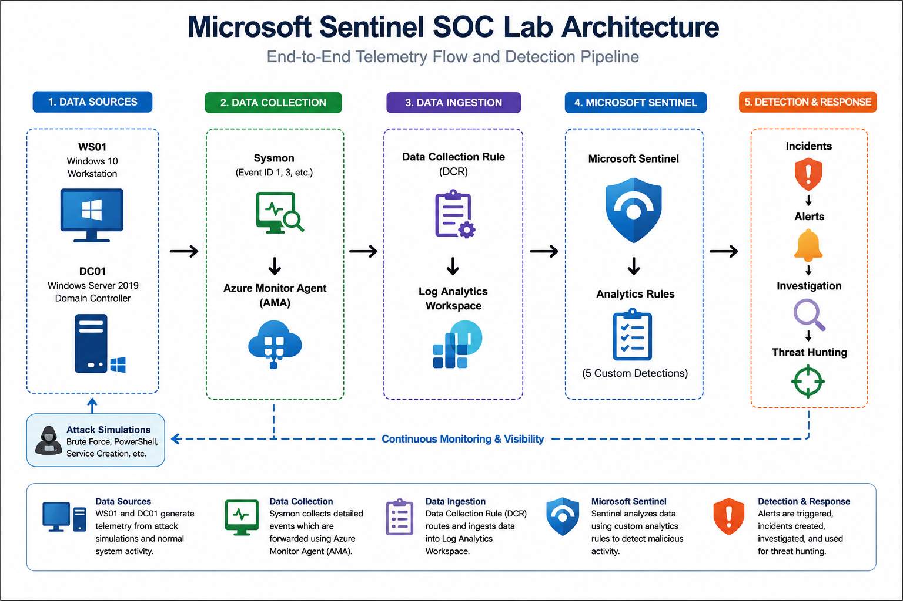


---

# Lab Overview

This project demonstrates:

- Microsoft Sentinel deployment and configuration
- Windows telemetry ingestion using AMA + DCR
- Sysmon event collection and monitoring
- Custom analytics rule development
- Threat hunting with KQL
- MITRE ATT&CK mapped detections
- Incident generation and investigation
- SOC workflow simulation

---

# Environment Architecture

## Infrastructure

| Component | Purpose |
|---|---|
| Microsoft Sentinel | SIEM & Incident Management |
| Log Analytics Workspace | Centralized log storage |
| Azure Monitor Agent (AMA) | Telemetry collection |
| Data Collection Rule (DCR) | Event filtering and routing |
| Sysmon | Advanced Windows event logging |
| Windows Server (DC01) | Domain Controller |
| Windows Workstation (WS01) | User endpoint |

---

# Telemetry Collected

The lab collects and analyzes:

- Windows Security Events
- Sysmon Process Creation Events
- PowerShell Execution Activity
- Failed Login Attempts
- Service Creation Events
- Registry Modification Events
- Authentication Logs
- Process Execution Metadata

---

# Data Collection Pipeline

Telemetry from Sysmon and Windows Security Events is collected through Azure Monitor Agent (AMA), filtered using Data Collection Rules (DCR), and ingested into Log Analytics Workspace for analysis within Microsoft Sentinel.

---

# Microsoft Sentinel Configuration

## Configured Components

- Windows Security Events via AMA
- Sysmon Telemetry Collection
- Data Collection Rules (DCR)
- Custom Analytics Rules
- Incident Generation
- MITRE ATT&CK Mapping

---

# Detection Rules Built

## 1. Excessive Failed Logins

Detects multiple failed authentication attempts that may indicate password spraying or brute force activity.

### MITRE ATT&CK
- Credential Access
- T1110 — Brute Force

### Severity
Medium

---

## 2. Encoded PowerShell Execution

Detects PowerShell executions using encoded commands commonly associated with obfuscation and malware execution.

### MITRE ATT&CK
- Execution
- Defense Evasion
- T1059.001 — PowerShell
- T1027 — Obfuscated Files or Information

### Severity
High

---

## 3. Remote Service Creation Detection

Detects suspicious service creation activity associated with lateral movement techniques.

### MITRE ATT&CK
- Lateral Movement
- T1021 — Remote Services

### Severity
High

---

## 4. Potential Credential Dumping

Detects suspicious process execution patterns related to credential dumping behavior.

### MITRE ATT&CK
- Credential Access
- T1003 — OS Credential Dumping

### Severity
High

---

## 5. Suspicious PowerShell Execution

Detects suspicious PowerShell usage patterns that may indicate malicious script execution.

### MITRE ATT&CK
- Execution
- T1059.001 — PowerShell

### Severity
Medium

---

# Threat Hunting Queries

## Encoded PowerShell Detection

```kusto
Event
| where Source == "Microsoft-Windows-Sysmon"
| where EventID == 1
| where RenderedDescription has "-EncodedCommand"
   or RenderedDescription has "-enc"
| project TimeGenerated, Computer, RenderedDescription
```

---

## Failed Login Hunt

```kusto
SecurityEvent
| where EventID == 4625
| summarize FailedAttempts=count() by Account
| where FailedAttempts >= 5
```

---

## Remote Service Creation Hunt

```kusto
Event
| where Source == "Microsoft-Windows-Sysmon"
| where EventID == 1
| where RenderedDescription has "sc.exe"
| project TimeGenerated, Computer, RenderedDescription
```

---

# Incident Investigation

The lab demonstrates:

- Alert triage
- Incident investigation
- MITRE ATT&CK categorization
- Query-driven analysis
- Timeline correlation
- Endpoint telemetry review

Generated incidents include:

- Encoded PowerShell Execution
- Excessive Failed Logins
- Remote Service Creation Detection
- Potential Credential Dumping

---

# Screenshots Included

- Microsoft Sentinel Analytics Rules
- Advanced Hunting Queries
- Incident Investigation Panels
- AMA Connector Configuration
- Data Collection Rules (DCR)
- Sysmon Operational Logs
- Sentinel Incident Dashboard
- Azure Resource Configuration

---

# Skills Demonstrated

## SIEM Engineering
- Microsoft Sentinel
- Log Analytics
- Analytics Rule Creation
- Incident Management

## Detection Engineering
- KQL Query Development
- Threat Detection Logic
- MITRE ATT&CK Mapping

## Endpoint Monitoring
- Sysmon Configuration
- Windows Event Analysis
- PowerShell Monitoring

## Threat Hunting
- Log Correlation
- IOC Analysis
- Behavioral Detection

---

# MITRE ATT&CK Techniques Covered

| Technique | ID |
|---|---|
| PowerShell | T1059.001 |
| Obfuscated Files or Information | T1027 |
| Brute Force | T1110 |
| Remote Services | T1021 |
| OS Credential Dumping | T1003 |

---
# Screenshots

---

## SOC Dashboard

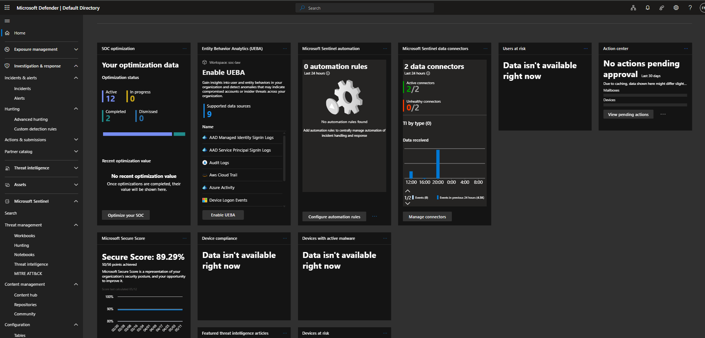

---

## Analytics Rules Overview

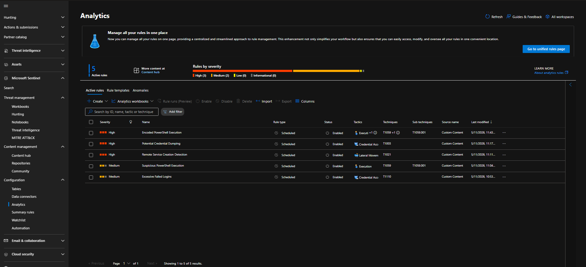

---

## Built-in Analytics Rules

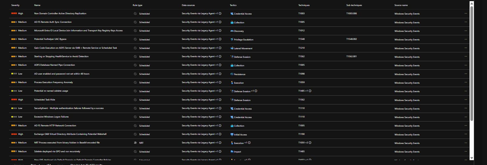

---

## Advanced Hunting – Encoded PowerShell

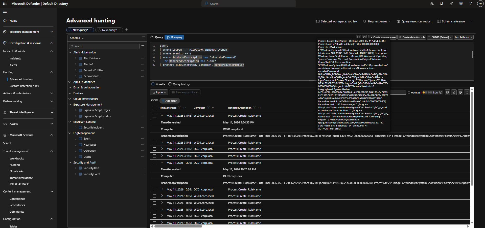

---

## Encoded PowerShell Incident

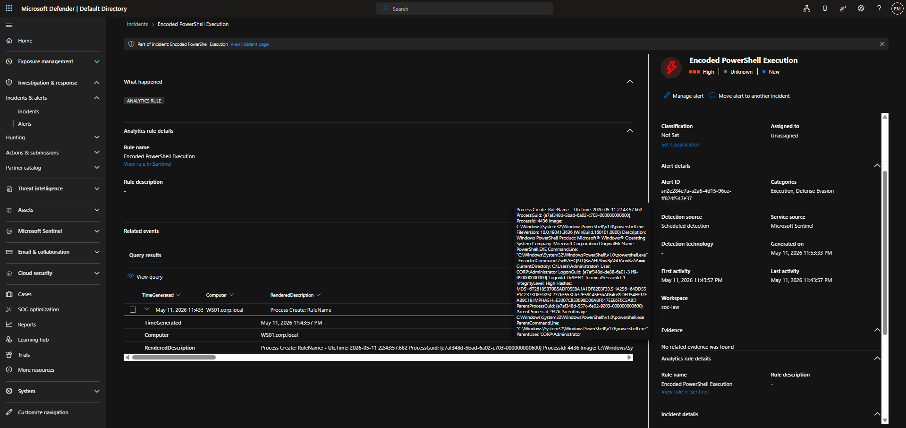

---

## Encoded PowerShell Rule Configuration

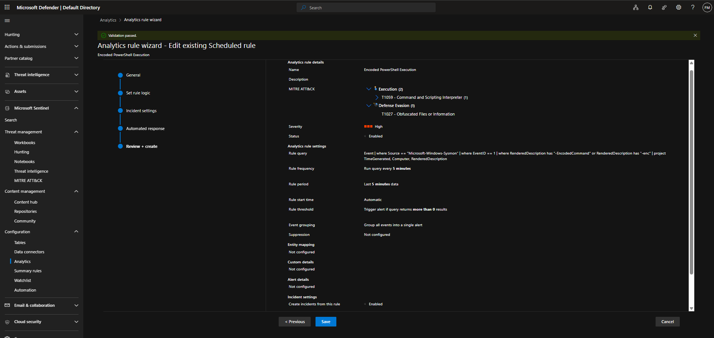

---

## Excessive Failed Logins Incident

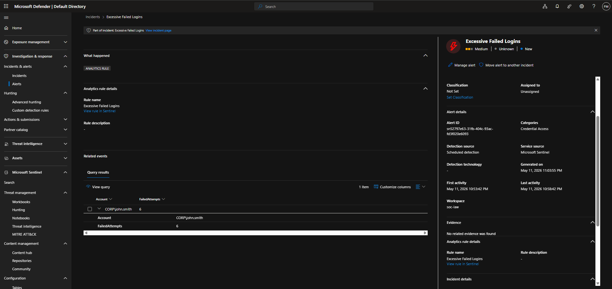

---

## Remote Service Creation Incident

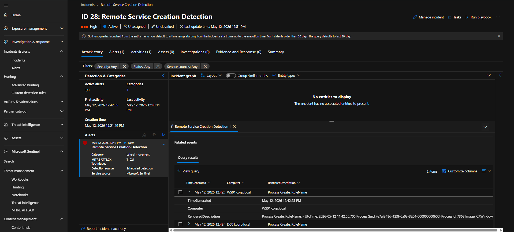

---

## Windows Security Events via AMA

)

---

## Sysmon DCR Resources

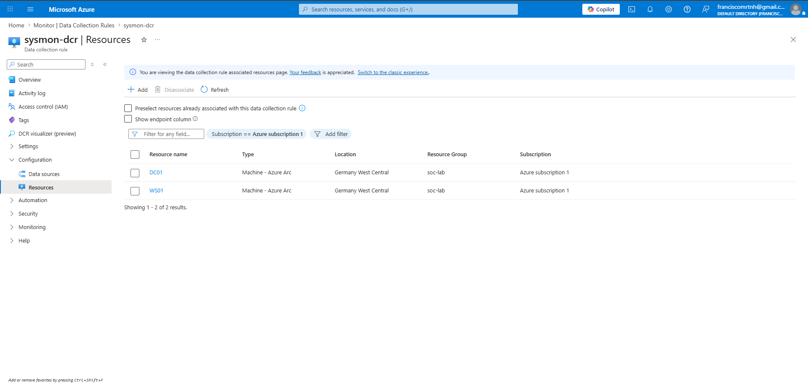

---

## Sysmon Operational Logs

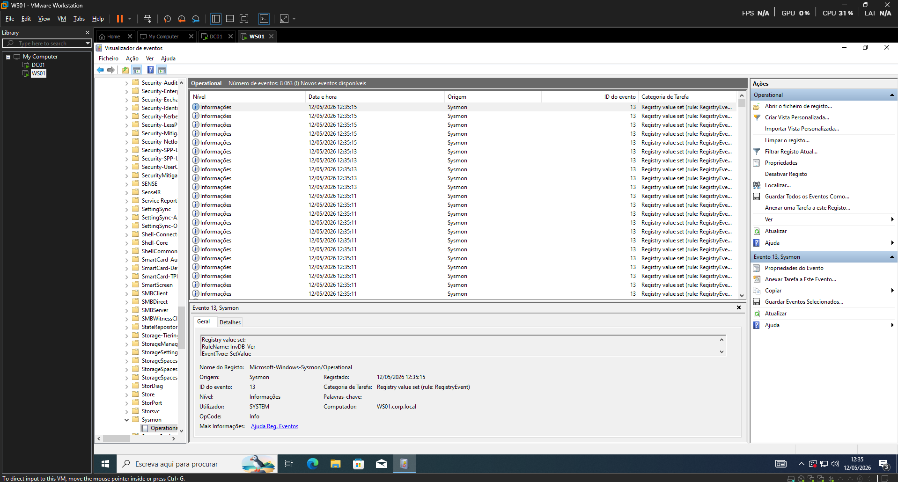

---

## Domain Controller DNS Configuration

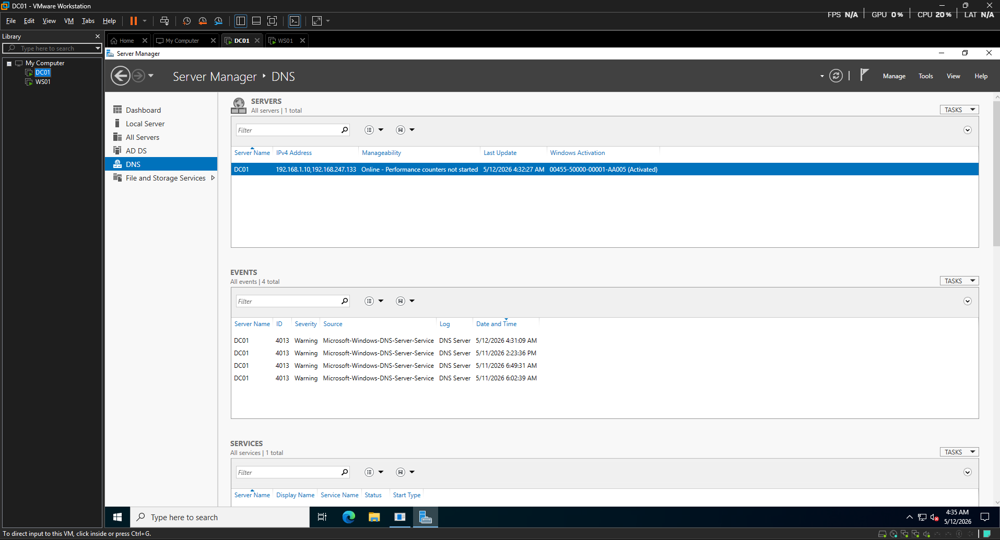

---

## Sentinel Incidents Dashboard

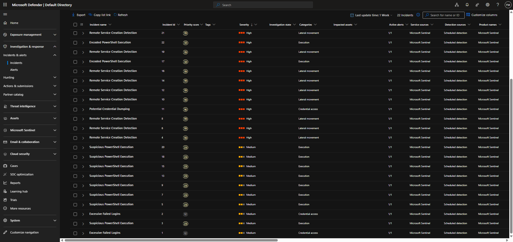

# Author

Francisco M.

Security Operations • Threat Hunting • Detection Engineering • Microsoft Sentinel
